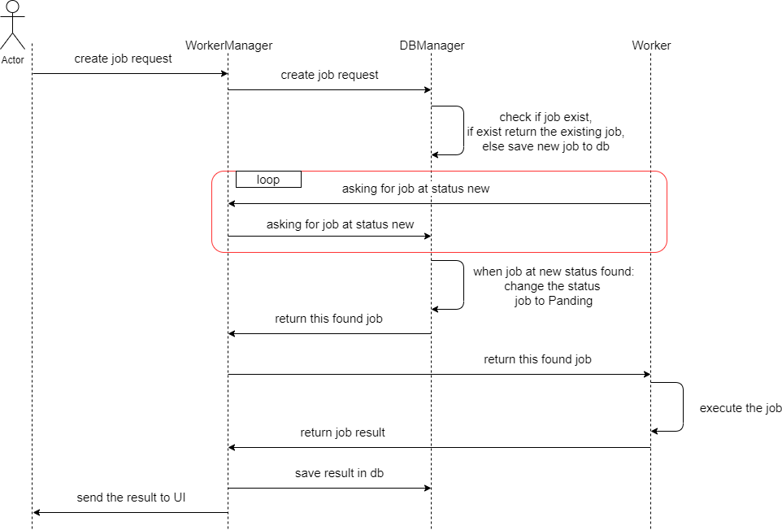

# WebCrawler
## What does WebCrawler do?
 Scrape the web according to:
  
 * The url to start scraping from.
 * The maximum depth to crawl down to from the start url.
 * The max number of pages for the entire scrape job.
  
 (Stop crawling a job when it reaches maxDepth or maxPages,
whichever comes first.)
  
## Architecture:

### create new job flow

## Quick Start:

1. run comman "npm install" in activefence_challenge folder and in \activefence_challenge\src\client.
2. run comman "npm start" in activefence_challenge folder and in \activefence_challenge\src\client.

## Tecnolegis:
* NodeJS
* React
* Express
* Web Storage
### Main packages:
* Socket.IO - enables real-time bidirectional event-based communication.
* Lowdb - Small JSON database for Node, Electron and the browser. Powered by Lodash. 
* node-html-parser - Fast HTML Parser is a very fast HTML parser. Which will generate a simplified DOM tree, with basic element query support.

## For future expansion:
1. Save running time for overlapping scrape jobs.
2. Calculating the number of "workers", dynamically depending on the loads and the number of scrape jobs to be performed.

